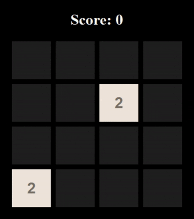

# 2048-Robot🤖


Play the game **2048** using a Deep Q-Network (DQN) agent.

## 🕹️Demo

<p align="center">
  
</p>

## 🚀 Getting Started

- **🔧 Training the Agent**

  To train the DQN agent from scratch:

    ```bash
    python train.py
    ```

- **🤖 Running the Bot**

    ```
    python bot.py
    ```